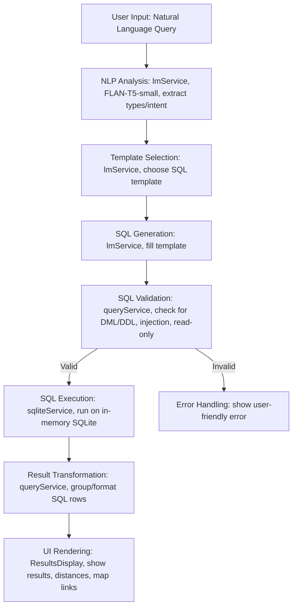

# NL2SQL Pipeline (Mermaid Diagram)

---

## Step Details

- **NLP Analysis**: Uses FLAN-T5-small to extract types and intent from the user's query.
- **Template Selection**: Picks the correct SQL template (proximity, type, fallback) based on intent.
- **SQL Generation**: Fills in the template with extracted types and parameters.
- **SQL Validation**: Ensures only safe, read-only SELECT statements are executed.
- **SQL Execution**: Runs the validated SQL against the in-memory SQLite database.
- **Result Transformation**: Converts SQL rows into grouped POI objects for display.
- **UI Rendering**: Displays results, distances, and map links to the user.
- **Error Handling**: Catches and displays errors if validation fails.
